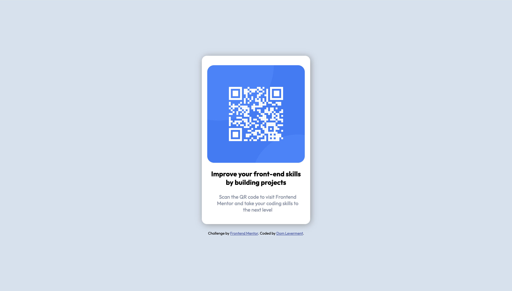

# Frontend Mentor - QR code component solution

This is a solution to the [QR code component challenge on Frontend Mentor](https://www.frontendmentor.io/challenges/qr-code-component-iux_sIO_H). Frontend Mentor challenges help you improve your coding skills by building realistic projects. 

## Table of contents

- [Overview](#overview)
  - [Screenshot](#screenshot)
  - [Built with](#built-with)
  - [What I learned](#what-i-learned)
  - [Continued development](#continued-development)
- [Author](#author)

## Overview

I have just finished the html and css sections on zero-to-mastery and this is my first challenge to help solidify some of that learning. I will move onto the next challenges to help me more. I don't think i would have been able to do this without the design files also from figma. well worth the annual purchase.

### Screenshot

### Built with

- Semantic HTML5 markup
- CSS custom properties
- Flexbox

### What I learned

I've learn to practice hmtl, css and flexbox. Also to google a lot. ChatGPT can also be a good help when wrangling css properties.

### Continued development
I'll move onto the next challenges as i definitely need practice with css.

## Author

- Frontend Mentor - [@domleverment](https://www.frontendmentor.io/profile/DomLeverment)
- Linkedin - https://www.linkedin.com/in/dom-leverment-1262a175/?original_referer=https%3A%2F%2Fwww%2Egoogle%2Ecom%2F&originalSubdomain=uk 

